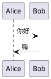
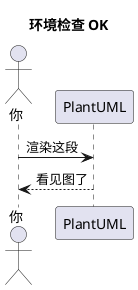

# 00 · 导读与环境

← [[PlantUML从入门到精通|目录]] · 下一章 → [[01-基础语法与通用命令]]

---

## 1. PlantUML 是什么

PlantUML 用**纯文本**描述图，由引擎自动布局并渲染成 PNG / SVG 等。  
核心理念：**图也是代码**——可进 Git、可 Code Review、可和 Markdown 一起写。

适合画：序列图、用例图、类图、活动图、组件图、部署图、状态图、定时图，以及甘特、思维导图、界面线框（Salt）等。

官方总览：https://plantuml.com/zh/

## 2. 为什么用它（对比拖拽工具）

| 维度 | PlantUML | Visio / 画板类 |
|------|----------|----------------|
| 版本控制 | 文本 diff 清晰 | 二进制难审 |
| 修改成本 | 改一行文字 | 拖拽对齐 |
| 协作合并 | Git merge 友好 | 易冲突 |
| 布局 | 自动（偶需人工微调方向） | 完全手动 |
| 嵌入文档 | Markdown / Obsidian / Wiki 原生 | 常靠截图 |

**不适用**：极复杂的信息图表美术稿、需要像素级海报排版时，仍用设计工具。

## 3. 三种使用方式（由易到难）

### 3.1 在线编辑器（零安装）

打开 https://www.plantuml.com/plantuml ，左侧写文本，右侧出图。  
适合：验证语法、给同事甩一段即可复现的图。

### 3.2 Obsidian（本库主路径）

本库已安装 **PlantUML** 插件。在笔记中：

````markdown

````

预览/阅读模式应能看到图。当前插件可走远端 server（如 `https://www.plantuml.com/plantuml`），也可配本地 jar。

细节见 → [[14-Obsidian与工作流]]

### 3.3 本地 jar / IDE

依赖：Java 8+；复杂布局常还需 Graphviz。

```bash
java -version
# 生成 PNG
java -jar plantuml.jar diagram.puml
# 生成 SVG
java -jar plantuml.jar -tsvg diagram.puml
```

- VS Code：扩展 “PlantUML”，预览快捷键多为 `Alt+D`
- IntelliJ：插件 “PlantUML integration”

官方起步：https://plantuml.com/starting

## 4. 五分钟验证环境

在任意笔记粘贴：



| 结果      | 处理                                                     |
| ------- | ------------------------------------------------------ |
| 出图      | 进入 [[01-基础语法与通用命令]]                                    |
| 空白 / 报错 | 检查语言标识是否为 `plantuml`；`@startuml`/`@enduml` 是否成对；插件是否启用 |
| 中文方框    | 本地 jar 字体问题 → 先改用远端 server，或配置中文字体（见 FAQ）              |

## 5. 本系列怎么读

1. **必读**：00 → 01 → **02 时序图**（工作里用得最多）  
2. 再按需：**04 活动**（流程）、**05 类**（设计）、**08/09**（架构）  
3. 图要好看、要复用：12、13  
4. 写进日记/项目：14、15  

每章末有「练习」；建议打开 Obsidian 边看边改。

## 6. 参考来源（本系列依据）

- 官网各图类型页（sequence / class / activity-beta / state …）
- [PlantUML Language Reference Guide](https://pdf.plantuml.net/PlantUML_Language_Reference_Guide_en.pdf)
- 社区长文结构参考：图表类型划分、安装路径、样例组织方式（内容按官方语法重写，避免过时写法）

---

下一章 → [[01-基础语法与通用命令]]
