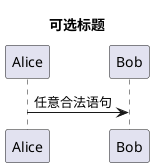
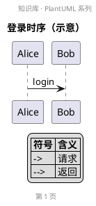
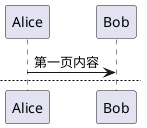
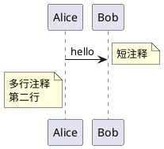
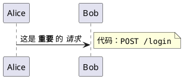
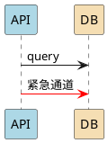
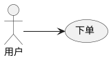
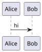
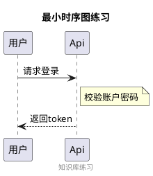

# 01 · 基础语法与通用命令

← [[00-导读与环境]] · [[PlantUML从入门到精通|目录]] · 下一章 → [[02-时序图]]

---

## 1. 所有图的共同骨架

要点：

1. **成对标记**：`@startuml` … `@enduml`（甘特等见第 11 章，用 `@startgantt` 等）
2. **大小写**：关键字一般小写；参与者 / 类名大小写按你习惯
3. **一行一事**：箭头、声明尽量一行一条，排错更容易

## 2. 不同图类型的起止标记

| 图 | 起 | 止 |
|----|----|----|
| 多数 UML | `@startuml` | `@enduml` |
| 甘特 | `@startgantt` | `@endgantt` |
| 思维导图 | `@startmindmap` | `@endmindmap` |
| WBS | `@startwbs` | `@endwbs` |
| Salt 线框 | `@startsalt` | `@endsalt` |

忘记对应标记 = 完全不渲染或语法错。

## 3. 标题、页眉、页脚、图例

长图可分页（导出多页时有用）：

## 4. 注释 note（多数图通用思路）

类图 / 状态图还支持 `note top of`、`note bottom of`、`note on link` 等，各章细讲。

## 5. 文本格式（Creole / 少许 HTML）

消息与 note 里常用：

| 写法 | 效果 |
|------|------|
| `**粗体**` | **粗体** |
| `//斜体//` | 斜体 |
| `""等宽""` | 等宽 |
| `--删除线--` | 删除线 |
| `\n` | 换行 |

## 6. 颜色与内联样式（速览）

参与者 / 类可直接跟颜色：

箭头颜色：`-[#red]>`、`-[#0000FF]->`。  
系统级美化用 `!theme` / `skinparam`，见 → [[12-样式主题与排版]]。

## 7. 方向与尺度

缩放（大图预览）：

## 8. 布局引擎（了解即可）

默认常依赖 Graphviz。可选：

| 引擎       | 写法                       | 特点        |
| -------- | ------------------------ | --------- |
| Graphviz | 默认                       | 通用        |
| Smetana  | `!pragma layout smetana` | 内置、箭头更直一些 |
| ELK      | `!pragma layout elk`     | 正交布局，功能子集 |
| 时序 Teoz  | `!pragma teoz true`      | 时长、锚点等增强  |

新手：**先用默认**，图乱了再试方向关键字（`-left->`）或拆图。

## 9. 输出格式

- Obsidian 插件：PNG（常见）/ 按设置导出  
- CLI：`-tsvg`、`-tpng`、`-tpdf` 等  
- 在线：复制编码链接分享  

日常笔记优先 SVG（清晰）或 PNG（兼容）。

## 10. 练习

1. 写一张带 `title` + `footer` + 一条 `note` 的最小时序图。  
2. 故意去掉 `@enduml`，看插件报什么；再改回来。  
3. 把消息改成带 `**粗体**` 和 `\n` 换行。

---

下一章 → [[02-时序图]]（本系列最重要一章）
