# 02 · 时序图（Sequence）

← [[01-基础语法与通用命令]] · [[PlantUML从入门到精通|目录]] · 下一章 → [[03-用例图]]

官方：https://plantuml.com/zh/sequence-diagram

时序图按**时间顺序**描述对象之间如何发消息。接口文档、鉴权链路、支付回调——优先用它。

---

## 1. 最小例子

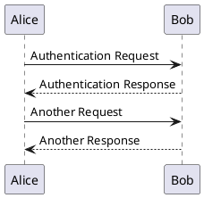

| 符号           | 含义                  |
| ------------ | ------------------- |
| `->`         | 实线箭头（常表请求）          |
| `-->`        | 虚线箭头（常表返回）          |
| `<-` / `<--` | 反向写法，画面等价，可读性更好时可混用 |

参与者**不必预先声明**，首次出现即创建。

---

## 2. 声明参与者与外形

显式声明可控制**外形、颜色、从左到右顺序**：

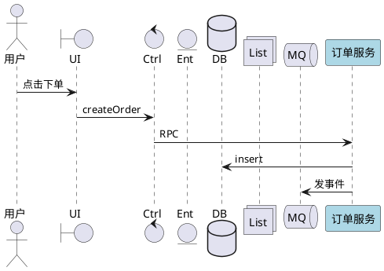

关键字外形：

| 关键字           | 典型含义            |
| ------------- | --------------- |
| `actor`       | 人或外部角色          |
| `participant` | 通用参与者（矩形）       |
| `boundary`    | 边界（界面 / API 边缘） |
| `control`     | 控制类             |
| `entity`      | 实体              |
| `database`    | 数据库             |
| `collections` | 集合              |
| `queue`       | 队列              |

别名：`as`。长名字用引号：`participant "非常长的\n名字" as L`。

### 强制显示顺序：`order`

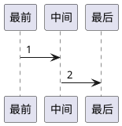

数字越小越靠左（默认声明顺序 = 显示顺序）。

---

## 3. 消息样式与颜色

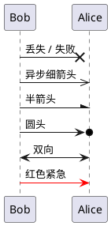

给自己发消息（内部处理）：

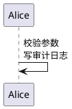

---

## 4. 生命线激活 / 返回

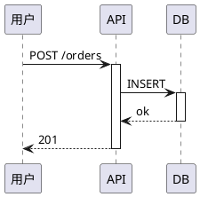

简写：`API -> DB ++` 激活对方；`--` 停用；`return 文案` 生成返回消息（部分引擎支持）。

嵌套调用时务必成对 activate/deactivate，否则生命线「粘住」。

---

## 5. 组合片段（交互框）——必会

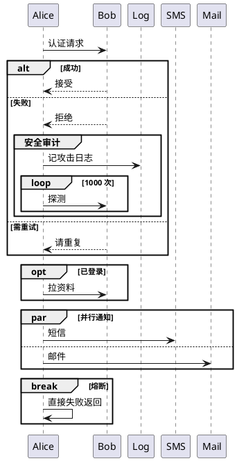

| 关键字 | 用途 |
|--------|------|
| `alt` / `else` / `end` | 互斥分支 |
| `opt` / `end` | 可选 |
| `loop` / `end` | 循环 |
| `par` / `else` / `end` | 并行 |
| `break` / `end` | 中断后续 |
| `critical` / `end` | 临界区 |
| `group 标题` / `end` | 自定义分组 |
| `group 标题 [次级标签]` | 分组副标题 |

可嵌套；`end` 不要漏。

---

## 6. 自动编号 autonumber

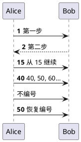

格式串（Java DecimalFormat）：

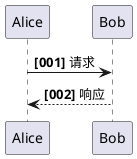

多级编号：`autonumber 1.1.1`，`autonumber inc A` / `inc B` 进位。  
注释里可用 `%autonumber%` 引用当前值。

---

## 7. 注释、分隔、引用、延迟、留白

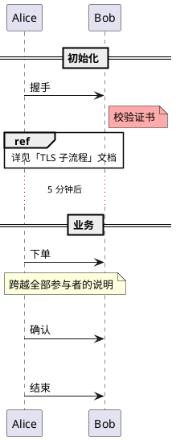

| 写法 | 作用 |
|------|------|
| `== 标题 ==` | 逻辑阶段分隔 |
| `note left/right` | 跟在上一条消息旁 |
| `note left/right/over of X` | 相对参与者 |
| `note across` | 横跨全图 |
| `hnote` / `rnote` | 六边形 / 矩形备注 |
| `ref over` | 引用其它交互 |
| `...` / `...文字...` | 延迟 |
| `\|\|\|` / `\|\|45\|\|` | 垂直留白（像素） |

同一高度对齐多条 note：第二行前加 `/`。

---

## 8. 创建、页脚、分页、隐藏底栏

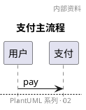

`hide footbox` 去掉参与者底部名字条，图更紧凑。

---

## 9. 完整实战：支付（建议收藏）

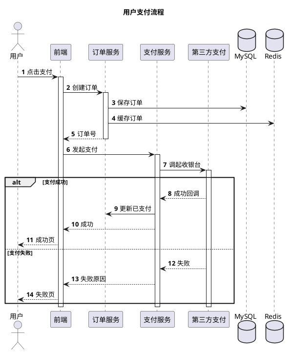

---

## 10. 文本与布局微调

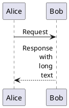

过长中文换行优先手动 `\n`。参与者过多（>6～8）：**拆图**比硬挤更好。

Teoz 引擎（进阶）：`!pragma teoz true`，支持时长条、锚点等，见官网。

---

## 11. 速查

```
actor / participant / database / queue …
A -> B: msg     A --> B: return
activate X / deactivate X
alt / else / end   opt / loop / par / break / group
autonumber [start [step]] [ "format" ]
== 阶段 ==    ...延迟...    |||
note right of X    note across    ref over A,B
title / header / footer / hide footbox / newpage
```

## 12. 练习

1. 画「短信登录」：发码 → 校验 → 成功/失败 `alt`。  
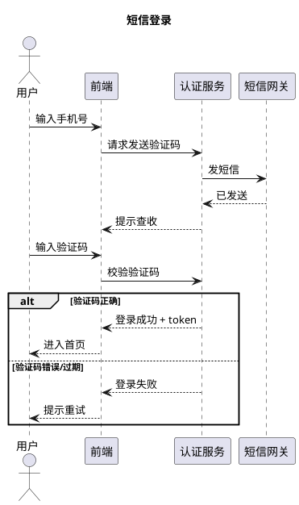
1. 给所有消息加上 `autonumber`，失败分支用 `group` 标出。  
2. 把本库 [[上下面-三段式]] 改造成带 `database` 的三段调用。

---

下一章 → [[03-用例图]]
