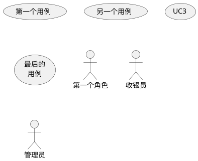
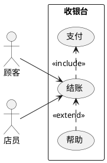
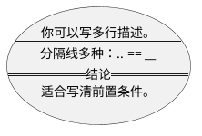
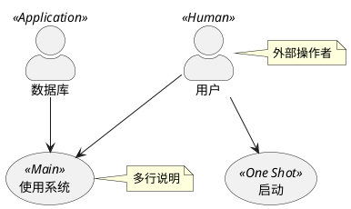
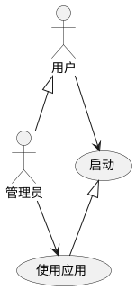
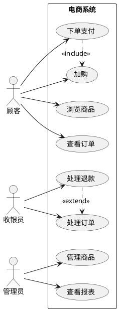
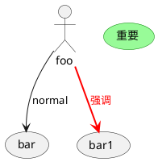

# 03 · 用例图（Use Case）

← [[02-时序图]] · [[PlantUML从入门到精通|目录]] · 下一章 → [[04-活动图]]

官方：https://plantuml.com/zh/use-case-diagram

用例图回答：**谁（角色）能用系统做什么（用例）**。适合需求研讨，不适合画接口细节（那是时序图）。

---

## 1. 用例与角色的声明

- 用例：圆括号 `(用例)` 或 `usecase`
- 角色：冒号 `:角色:` 或 `actor`
- `as` 起别名，后面连线更短

业务造型（椭圆/人带斜杠）：`(用例)/`、`actor/`（业务用例符号）。

---

## 2. 关联、方向、包

| 关系 | 常见画法 | 含义 |
|------|----------|------|
| 关联 | `-->` / `--` | 角色使用用例 |
| include | `.>` + `<<include>>` | 基用例**必定**包含 |
| extend | `.>` + `<<extend>>` | **可选**扩展 |
| 泛化 | `<|--` | 角色或用例继承 |

`left to right direction` 对用例图几乎总是更易读。  
`rectangle` / `package` 用来圈「系统边界」。

箭头长度：`-` 越多通常越长；也可用 `-left->` `-right->` `-up->` `-down->`。

---

## 3. 多行用例描述与分隔

---

## 4. 角色样式、构造型、注释

---

## 5. 角色 / 用例继承

---

## 6. 完整样例：电商结账

---

## 7. 内联改色（可选）

---

## 8. 练习

1. 画出你当前项目的 3 个角色 + 5 个用例，系统用 `rectangle` 包起来。  
2. 给一对用例补上 `<<include>>` 或 `<<extend>>`，并写一句注释说明为何。  
3. 同一张需求：先用例图定边界，再为「下单支付」单独开一时序图（链到日记或项目笔记）。

---

下一章 → [[04-活动图]]
