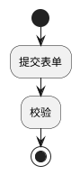
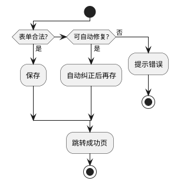
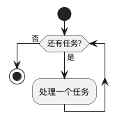
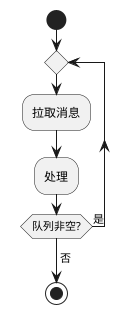
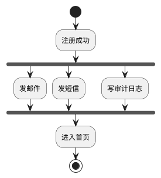
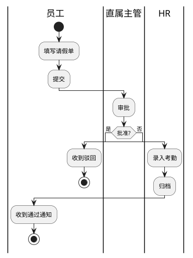
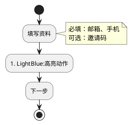
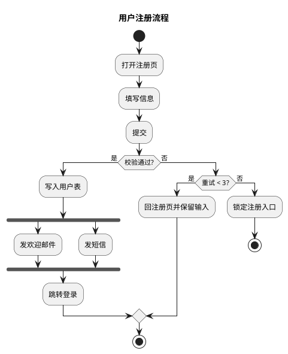

# 04 · 活动图（Activity）

← [[03-用例图]] · [[PlantUML从入门到精通|目录]] · 下一章 → [[05-类图]]

官方（新语法）：https://plantuml.com/zh/activity-diagram-beta  
旧语法仍可见：https://plantuml.com/zh/activity-diagram-legacy —— **本库只用新语法**。

活动图描述**流程 / 算法 / 审批**：「先做什么，再判断什么，何时并行」。

---

## 1. 起止与动作

- `start` / `stop`：开始、终止  
- `:动作;`：一个活动（冒号 + 文案 + 分号）  
- `end`：结束流但不一定画成粗终止点（与 `stop` 略有差别，日常用 `stop` 即可）

---

## 2. 分支 if / else / elseif

嵌套 if 很常见；每个 `if` 必须有配对 `endif`。

箭头标签用 `then (是)` / `else (否)` 写出决策含义。

---

## 3. 循环 while / repeat

---

## 4. 并行 fork

`fork` … `fork again` … `end fork`：并行多条，全部完成再继续。

---

## 5. 泳道（partition / |名称|）

审批流强烈建议泳道，看清**谁负责哪一步**：

也可用 `partition 名称 { ... }` 做分区（样式略有不同）。

---

## 6. 注释、颜色、连接线文字

---

## 7. 完整样例：用户注册

---

## 8. 与时序图怎么分工

| 问题 | 用 |
|------|-----|
| 业务步骤、审批、算法分支 | **活动图** |
| 对象间消息与返回值 | **时序图** |
| 同一个「下单」 | 活动看业务；时序看服务调用 |

---

## 9. 练习

1. 把你们组的「发布上线检查清单」画成活动图（含至少一次 `if`）。  
2. 用泳道画「请假三级审批」：员工 / 主管 / HR。  
3. 注册成功后的三件并行事用 `fork` 表达。

---

下一章 → [[05-类图]]
