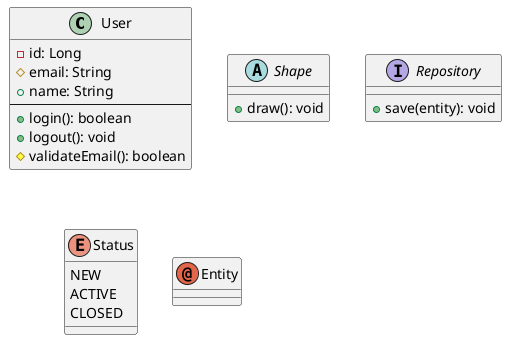
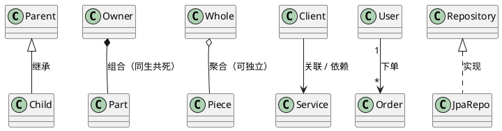
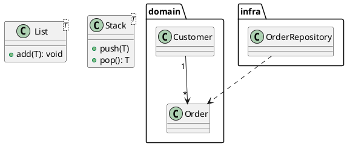
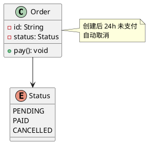
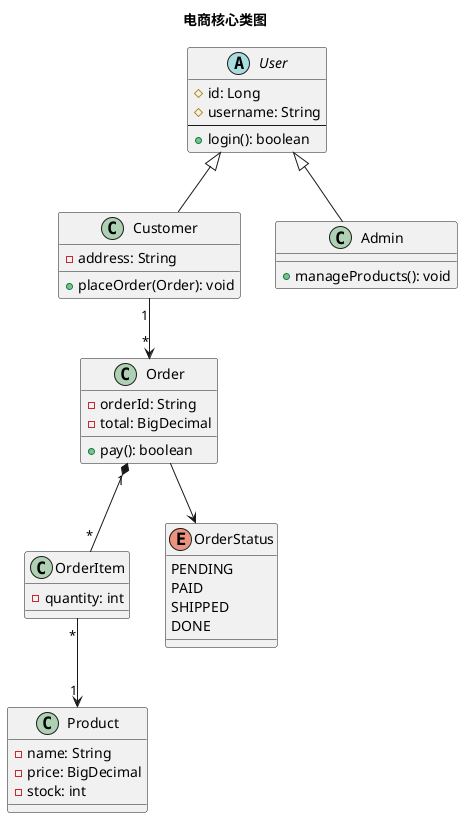
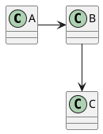

# 05 · 类图（Class）

← [[04-活动图]] · [[PlantUML从入门到精通|目录]] · 下一章 → [[06-对象图]]

官方：https://plantuml.com/zh/class-diagram

类图描述**静态结构**：有哪些类型、字段与方法、彼此什么关系。做领域模型、模块边界时用它。

---

## 1. 声明类与成员

可见性：`+` public · `-` private · `#` protected · `~` package  
`--` 分隔字段与方法区。未声明的类在关系里第一次出现时会自动创建。

也可：`class User extends Base`、`class A implements B`（与关系箭头等价的糖）。

---

## 2. 关系速查（务必分清）

| 符号 | UML 含义 | 记法 |
|------|----------|------|
| `<|--` | 泛化 / 继承 | 空心三角指向**父类** |
| `<|..` | 实现接口 | 虚线 + 三角 |
| `*--` | 组合 | 实心菱形在整体侧 |
| `o--` | 聚合 | 空心菱形在整体侧 |
| `-->` | 关联 / 依赖 | 有方向引用 |
| `..>` | 依赖 | 虚线依赖 |
| `--` | 关联 | 无方向 |

多重性写在两端：`"1" --> "*"`、`"0..1"`、`"1..*"`。

---

## 3. 泛型、嵌套、包

---

## 4. 立体关系与 note

隐藏部分成员：`hide User methods`、`hide Circle fields`、`hide empty members`。

---

## 5. 完整样例：电商核心类

---

## 6. 箭头方向与布局

默认偏纵向。关系可用 `-left-` `-right-` `-up-` `-down-` 微调；类太多就拆包、拆图。

---

## 7. 练习

1. 为你熟悉的一个模块画 4～6 个类，至少含继承或接口实现各一次。  
2. 标清组合 vs 聚合：订单与订单行、班级与学生分别用哪种？  
3. 给最重要的类加 `note`，写一条业务不变量。

---

下一章 → [[06-对象图]]
