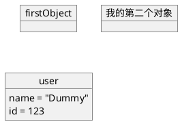
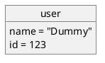
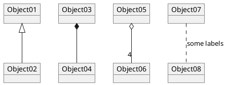
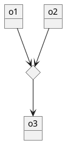
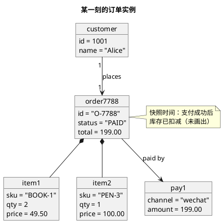
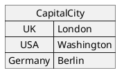
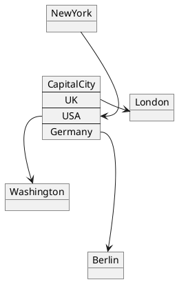
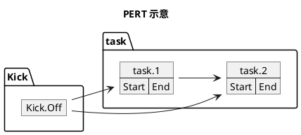
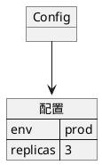
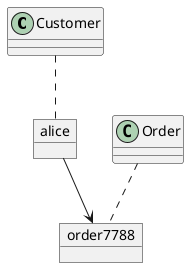

# 06 · 对象图（Object）

← [[05-类图]] · [[PlantUML从入门到精通|目录]] · 下一章 → [[07-状态图]]

官方：https://plantuml.com/zh/object-diagram

对象图是类图在**某一时刻的实例快照**：具体对象、字段当前值、实例之间的链接。适合讲清「此刻系统里到底有什么」。

---

## 1. 何时用对象图

| 场景 | 用对象图 | 用类图 |
|------|----------|--------|
| 给新人讲一笔真实订单长什么样 | ✅ | 只看到类型 |
| 定义领域规则、多重性 | 辅助例子 | ✅ 主图 |
| 排障：内存/会话里对象图 | ✅ | 不直观 |

口诀：**类图画规则，对象图画例子。**

---

## 2. 声明对象

也可用冒号逐条写属性：

---

## 3. 对象之间的关系

符号与类图一致，但语义落在**实例**上：

| 类型 | 符号 |
|------|------|
| 扩展 | `<|--` |
| 实现 | `<|..` |
| 组合 | `*--` |
| 聚合 | `o--` |
| 关联 / 依赖 | `-->` / `..>` |

虚线关系：把 `--` 换成 `..`。标签用 `: 文字`，多重性用 `"1"` / `"*"` 写在两端。

---

## 4. 关联类式：diamond

多个对象汇聚到一个菱形关联：

---

## 5. 业务样例：一笔订单快照

---

## 6. map：表 / 关联数组

与对象连线、指向 map 中某一项：

也可用 map 做简易 PERT 节点（任务表）：

---

## 7. 混入 JSON 展示

---

## 8. 与类图并排

文档里建议：上半页类图、下半页对象图，或分两个笔记互相 `[[链接]]`。

---

## 9. 练习

1. 选一张已有类图，造两个实例画对象图。  
2. 用对象图解释「一个用户两笔未支付订单」。  
3. 用 `map` 表示一次「国家 → 仓库节点」配置表，并链到仓库对象。

---

下一章 → [[07-状态图]]
