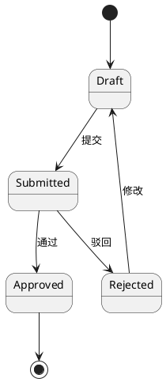
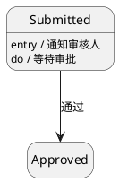
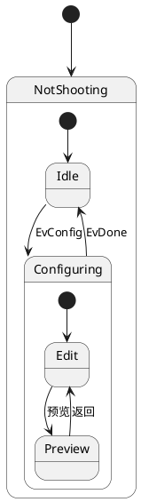
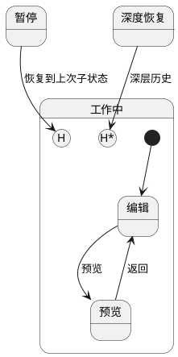
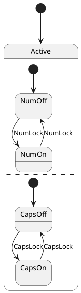
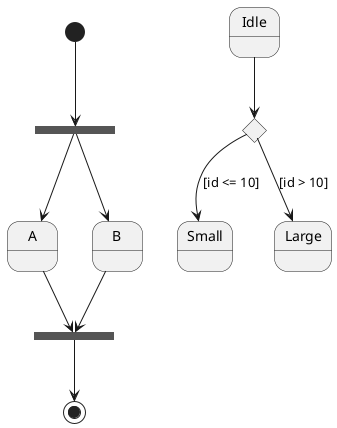
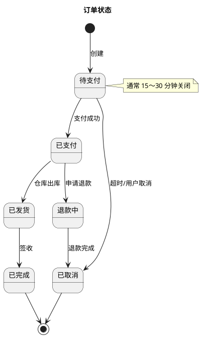
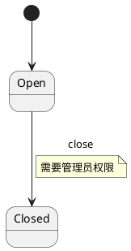

# 07 · 状态图（State）

← [[06-对象图]] · [[PlantUML从入门到精通|目录]] · 下一章 → [[08-组件图]]

官方：https://plantuml.com/zh/state-diagram

状态图描述对象在生命周期中**处在什么状态、因何事件转移**。订单、工单、连接会话都很适合。

---

## 1. 起止与简单转移

`[*]`：初始或终止。`状态 --> 状态 : 事件/动作`。

给状态加内部说明：

---

## 2. 组合（嵌套）状态

---

## 3. 历史状态 [H] / [H*]

`[H]`：同一层历史；`[H*]`：深层历史。

---

## 4. 并发区域 -- / ||

`--` 水平分隔并发；`||` 竖直分隔。

---

## 5. fork / join / choice

---

## 6. 完整样例：订单状态

---

## 7. 注释与链路上的 note

---

## 8. 练习

1. 画「工单」：新建 → 处理中 → 待确认 → 关闭，含驳回回退。  
2. 给「处理中」做成组合状态，内含「调研 / 开发 / 联调」。  
3. 解释清楚：订单取消可以从哪些状态到达？用图证明。

---

下一章 → [[08-组件图]]
