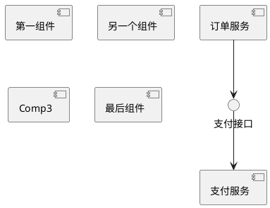
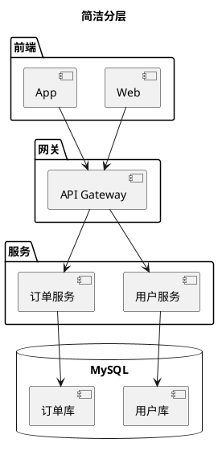
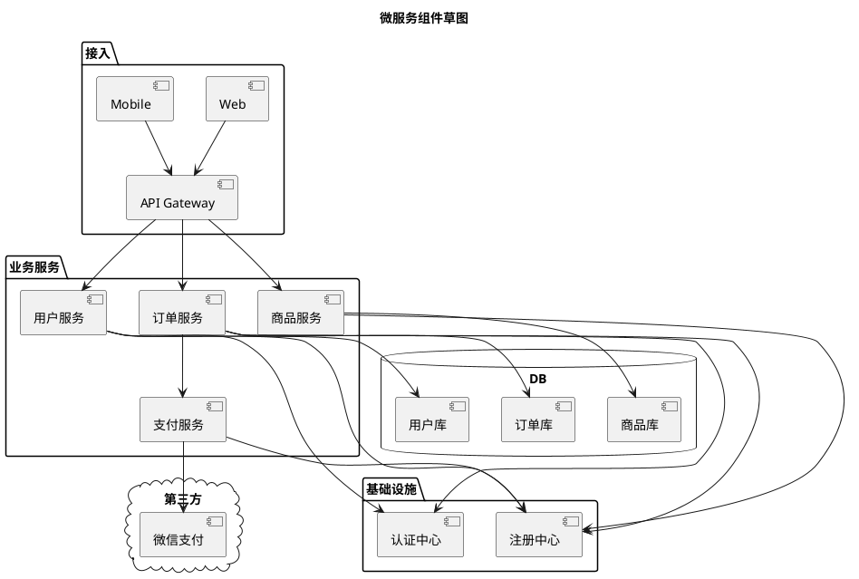

# 08 · 组件图（Component）

← [[07-状态图]] · [[PlantUML从入门到精通|目录]] · 下一章 → [[09-部署图]]

官方：https://plantuml.com/zh/component-diagram

组件图看**软件如何拆成可部署/可替换的块**及依赖。画微服务边界、前后端分层时很常用。

---

## 1. 组件与接口

`[名称]` 或 `component`；`()` 表示接口。

---

## 2. 包分层与数据库

---

## 3. 完整样例：微服务草图

---

## 4. 与部署图的分工

| 问题 | 用 |
|------|-----|
| 逻辑模块谁依赖谁 | **组件图** |
| 跑在哪台机器 / 哪个 K8s 服务 | **部署图** |

可先组件、后部署；或同主题各一张。

---

## 5. 练习

1. 画出你当前项目真实的「前端 / BFF / 两服务 / 一库」。  
2. 标出一个外部依赖（对象存储或支付），放入 `cloud`。  
3. 给最容易出问题的依赖加 `note`。

---

下一章 → [[09-部署图]]
