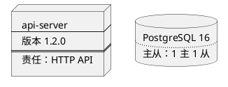
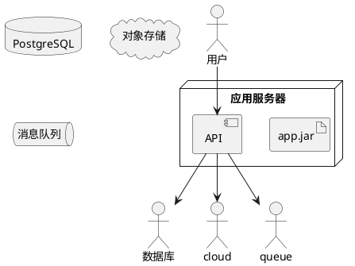
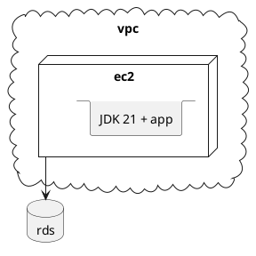
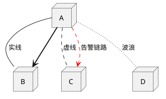
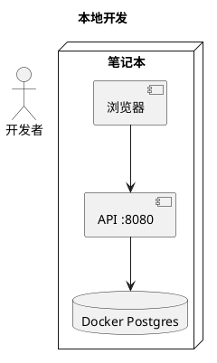
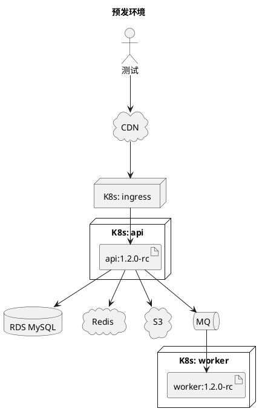
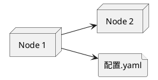

# 09 · 部署图（Deployment）

← [[08-组件图]] · [[PlantUML从入门到精通|目录]] · 下一章 → [[10-定时图]]

官方：https://plantuml.com/zh/deployment-diagram

部署图描述**软硬件拓扑**：节点、工件、通信路径。回答「这些进程/制品跑在哪儿」。

与 [[08-组件图]] 分工：组件看逻辑依赖；部署看物理/运行时落点。

---

## 1. 可声明的元素（选型）

部署图可用的立体很多，常用如下：

| 关键字 | 典型用途 |
|--------|----------|
| `node` | 服务器、VM、K8s Node、设备 |
| `artifact` | jar / 镜像 / 包 |
| `component` | 运行中的组件 |
| `database` | 数据库 |
| `cloud` | 公有云 / SaaS |
| `queue` | 消息队列 |
| `folder` / `file` | 目录与文件 |
| `frame` / `package` | 分组框 |
| `storage` / `stack` | 存储、技术栈块 |
| `actor` / `agent` | 人、代理 |
| `card` / `rectangle` | 通用容器外形 |

长描述可写在 `[]` 里，并用分隔线：

简写：`[component]`、`()` 接口、`:actor:` 等与组件/用例相同。

---

## 2. 嵌套：node 里放 artifact

云里再套节点也很常见：

可嵌套类型包括：`artifact` `cloud` `node` `folder` `frame` `database` `queue` `package` …（几乎所有容器型元素）。

---

## 3. 链接样式

箭头头类型多样（`-->` `--*` `--o` 等），日常 **`-->` + 标签** 够用；强调失败路径再用颜色。

内联样式：`#line:red;line.bold;text:red`。

---

## 4. 完整样例：本地 Dev vs 预发

### 本地

### 预发

把两张图放进项目笔记，日记里只链差异三条（环境变量、DB、有无 worker）。

---

## 5. 方向与别名

单边方向：`-up->` `-down->` `-left->` `-right->`。别滥用，优先让 Graphviz 自己排。

---

## 6. 练习

1. 画本机 Dev：浏览器 → localhost → Docker DB。  
2. 画预发：Ingress + API + Worker + RDS + Redis。  
3. 用 `-[dashed]->` 标出「仅预发才有」的链路，并加 note。

---

下一章 → [[10-定时图]]
