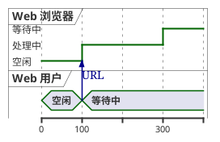
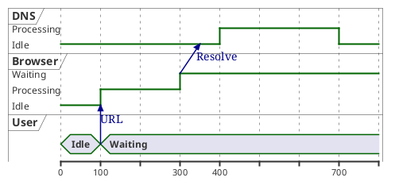
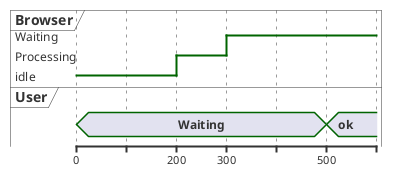
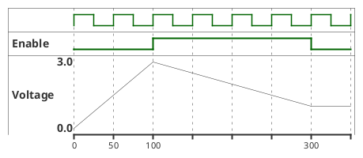
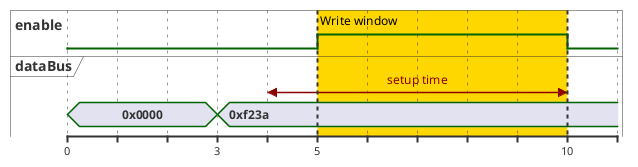
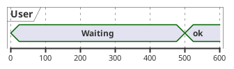
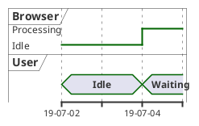
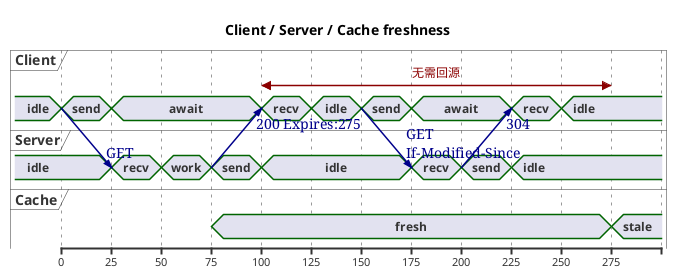

# 10 · 定时图（Timing）

← [[09-部署图]] · [[PlantUML从入门到精通|目录]] · 下一章 → [[11-非UML常用图]]

官方：https://plantuml.com/zh/timing-diagram

> 注意：官网中文页有时把 Timing 也译成「时序图」，易与 Sequence 混淆。  
> **Sequence = 消息顺序（[[02-时序图]]）；Timing = 时间轴上的状态/信号。**

定时图适合：超时、缓存新鲜度、握手时序、硬件/协议波形。

---

## 1. 参与者类型

| 关键字 | 含义 |
|--------|------|
| `concise` | 紧凑状态条（适合业务状态） |
| `robust` | 折线状态（状态迁移更醒目） |
| `binary` | 高低电平二值信号 |
| `clock` | 时钟（`period` / `pulse` / `offset`） |
| `analog` | 连续模拟量（线性插值） |

用 `@时刻` + `is 状态` 描述变化；可用消息 `A -> B : 文案`。

---

## 2. 最小例子（Web 请求）

---

## 3. 相对时间与按参与者书写

也可把同一参与者的变化写在一块：

---

## 4. 时钟、二进制、模拟量

`clock "C1" as C1 with period 50 pulse 15 offset 10` 可调脉宽与偏移。

---

## 5. 锚点、约束、高亮

相对锚点：`@:en_high+6`、小数时刻 `@5.5`。  
时间约束：`WB@0 <-> @50 : {50 ms lag}`。

---

## 6. 缩放、日期轴、隐藏时间轴

日期：

`hide time-axis` 可隐藏轴；`manual time-axis` 仅在状态变化处打标。

---

## 7. 完整样例：HTTP 缓存新鲜度

---

## 8. 与 Sequence 对照

| 问题 | Sequence | Timing |
|------|----------|--------|
| 谁调用谁、参数 | ✅ | 弱 |
| 状态持续多久、是否重叠 | 弱 | ✅ |
| API 文档主图 | ✅ | 补充超时/SLA |

同一主题可两张图互相链接。

---

## 9. 练习

1. 画「200ms 超时」：User Waiting 与 API Processing 的重叠关系。  
2. 用 `highlight` 标出超时危险区间。  
3. 用 `binary` + `clock` 示意一次片选/使能脉冲（不一定真实硬件）。

---

下一章 → [[11-非UML常用图]]
