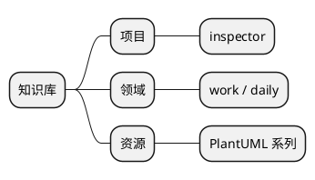
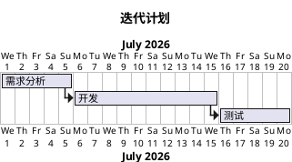
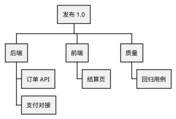
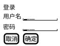
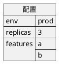

# 11 · 非 UML 常用图

← [[10-定时图]] · [[PlantUML从入门到精通|目录]] · 下一章 → [[12-样式主题与排版]]

官方还支持大量非 UML：思维导图、甘特、WBS、Salt 线框、JSON/YAML、ER、nwdiag 等。  
本章挑**笔记里最实用**的几种；完整列表见 https://plantuml.com/zh/

---

## 1. 思维导图 Mindmap

`*` 层级越多越深；也可用 `*_`、`*:` 等样式变体（见官网 mindmap 页）。

---

## 2. 甘特图 Gantt

注意起止是 `@startgantt` / `@endgantt`，不是 `@startuml`。

---

## 3. WBS 工作分解

---

## 4. Salt 线框（简单 UI）

适合评审交互草图；复杂 UI 仍建议专用设计工具。

---

## 5. ER / 数据

PlantUML 支持实体关系等多种数据图；需要时以官网 Entity Relationship 为准，避免与类图混用符号。

JSON 可视化示例：

---

## 6. 练习

1. 用 mindmap 拆一次本周工作。  
2. 用 gantt 排一个两周小迭代。  
3. 用 salt 画一个你正在做的设置页草稿。

---

下一章 → [[12-样式主题与排版]]
