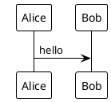
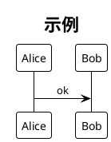

# 12 · 样式、主题与排版

← [[11-非UML常用图]] · [[PlantUML从入门到精通|目录]] · 下一章 → [[13-模块化与预处理]]

让图「能看」靠语法；让图「好可读、风格统一」靠主题与 skinparam。

---

## 1. 主题 !theme（最快）



**建议**：同一知识库固定 1～2 个主题，写在团队约定或 include 公共头里。

主题列表随版本扩展，以你安装的 PlantUML 版本为准。

---

## 2. skinparam 常用项

```plantuml
@startuml
skinparam backgroundColor #FEFEFE
skinparam shadowing false
skinparam roundcorner 8
skinparam defaultFontName SansSerif
skinparam sequenceArrowThickness 2
skinparam handwritten false

actor 用户
用户 -> API: ping
@enduml
```



按图类型可分组：

```plantuml
@startuml
skinparam class {
  BackgroundColor PaleGreen
  BorderColor SeaGreen
  ArrowColor DeepSkyBlue
}
class Foo
class Bar
Foo --> Bar
@enduml
```



时序消息对齐等见 [[02-时序图]]。

---

## 3. 单元素上色

```plantuml
@startuml
participant API #LightBlue
participant DB #Wheat
class Hot #FFCCCC
API -> DB: q
@enduml
```

---

## 4. 布局与可读性清单

1. **拆图**：一张图一个故事  
2. **方向**：用例/组件常 `left to right direction`  
3. **别名**：长中文名 `as Short`  
4. **order**（时序）：固定关键参与者在左侧  
5. **隐藏噪音**：`hide footbox`、`hide empty members`  
6. **引擎**：默认不行再 `!pragma layout smetana`；时序进阶 `!pragma teoz true`

官方布局说明摘要：Graphviz / Smetana / ELK / VizJs —— 见 https://plantuml.com/zh/

---

## 5. 本库推荐起始样式



先统一，再个别图微调颜色。

---

## 6. 练习

1. 同一张时序图切换 3 个 theme，截图对比（或并排笔记）。  
2. 为「危险路径」箭头设为红色，其余保持默认。  
3. 写 5 行公共 skinparam，准备放到下一章的 include 文件。

---

下一章 → [[13-模块化与预处理]]
