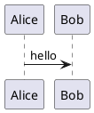
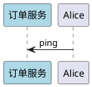
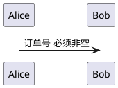
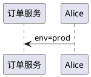

# 13 · 模块化与预处理

← [[12-样式主题与排版]] · [[PlantUML从入门到精通|目录]] · 下一章 → [[14-Obsidian与工作流]]

图一多就会复制粘贴参与者与样式。用 **include + 预处理** 做成可维护的「图组件」。

---

## 1. !include 原则

- **被 include 的片段不要写** `@startuml` / `@enduml`  
- 主图负责起止标记与 exclusive 内容  
- 路径取决于渲染器（CLI / Obsidian 插件 / 在线）——**不通就别先建空目录**，先复制或改用 URL include

片段示意 `_theme.puml`：

```
!theme plain
skinparam shadowing false
skinparam roundcorner 6
```

主图：



（本库暂不强制创建 `plantuml/` 子目录；真有第二张图复用时再加文件。）

官方也支持 `!includeurl`、标准库 `!include <...> `（如 C4、aws 等主题库，视版本而定）。

---

## 2. !define 宏（token 替换）



`!define` 是文本替换：写成 `participant SERVICE_NAME`，**不要**写成 `"%SERVICE_NAME%"`。

带参数：



---

## 3. 新预处理变量



支持 `!if` / `!endif` 等条件（版本相关，写复杂逻辑前先在在线编辑器验证）。

---

## 4. 函数与内置（了解）

`%autonumber%`、日期相关函数等可在特定上下文使用；以参考指南为准，避免教程写死易变细节。

---

## 5. 实操建议

| 做法 | 说明 |
|------|------|
| 公共主题头 | 一套 skinparam + theme |
| 公共参与者 | 仅当 ≥3 张图重复时再抽 |
| Obsidian | 本地 include 失败 → 粘贴或远端；不阻塞写图 |
| 命名 | `_` 前缀表示「片段非独立图」 |

---

## 6. 练习

1. 把第 12 章的推荐样式提成一段文本，两张主图各 include（或粘贴）一次。  
2. 用 `!$SERVICE` 画两张图，只改变量切换「订单 / 支付」服务名。  
3. 故意在片段里留下 `@startuml`，观察报错，再改掉。

---

下一章 → [[14-Obsidian与工作流]]
