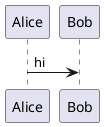

# 14 · Obsidian 与工作流

← [[13-模块化与预处理]] · [[PlantUML从入门到精通|目录]] · 下一章 → [[15-选型实战与FAQ]]

本库是 Obsidian + Git 知识库。这章解决：**图写哪儿、怎么预览、怎么和项目/日记联动**。

---

## 1. 本库插件现状

已启用社区插件 **PlantUML**（另有 Templater、Dataview、Omnisearch、Calendar 等）。  
配置里可见远端 server（如 `https://www.plantuml.com/plantuml`）与可选本地 `plantuml.jar`。

建议新手：**先远端渲染**，确认语法无误；对内网敏感图再改本地 jar。

---

## 2. 在笔记里正确嵌入

语言标识必须是 **`plantuml`**：

````markdown

````

常见失败：

| 写法 | 结果 |
|------|------|
| ` ```uml ` | 往往不渲染 |
| 缺少 `@enduml` | 语法错误 |
| 甘特却用 `@startuml` | 应改 `@startgantt` |

预览：阅读视图 / 实时预览（依主题与插件）。改完稍等 debounce（插件可配置秒级延迟）。

---

## 3. 图应该放在知识库哪一层

结合本库 PARA：

| 内容 | 位置 |
|------|------|
| 可复用教程、母版语法 | `30-资源`（本系列） |
| 某项目专属架构图 | `10-项目/<项目>/...` |
| 工作日临时草图 | `20-领域/work/daily/日期.md` 或先扔 `00-草稿箱` |
| 过期方案 | `40-归档` |

规则：**多用 `[[链接]]`，少为「再开一个 plantuml 空文件夹」**。真有公共片段再抽文件（见 [[13-模块化与预处理]]）。

示例：项目笔记链教程：

```markdown
支付链路见图（语法参考 [[02-时序图]]）。
```

---

## 4. 和日记模板联动

日记模板在 `90-系统/templates/日记模板.md`。可在「备注」里贴当天关键时序图，或只写 wikilink 指向项目下的 `.md` 图床笔记。

避免：把十几张大图全塞进单日日记 —— 日记留链接，图沉到项目笔记。

---

## 5. 导出与分享

- 插件设置中的导出路径 / 格式（PNG、SVG）  
- 敏感信息：发外网 server 前先脱敏（token、内网域名、真实客户名）  
- Git：只提交 `.md` 文本即可，一般不提交渲染缓存图（除非团队约定）

---

## 6. 本地 jar 提示

插件可填 `localJar` / `javaPath`。本机需：

```bash
java -version
# 可选
dot -V   # Graphviz
```

中文方块字：多为字体问题——换远端、或给 JVM/PlantUML 配中文字体。细节见 [[15-选型实战与FAQ]]。

---

## 7. 审阅与改稿

本库 Cursor agent：`kb-reviewer` —— 可对教程或项目图笔记做「评论 + 修改」。  
在对话中说：`用 kb-reviewer 审阅某路径`。

---

## 8. 练习

1. 在今日日记插一张 5 行时序图并预览。  
2. 把其中一张「会反复用」的图挪到 `10-项目`，日记只留 `[[wikilink]]`。  
3. 故意写错语言标识，确认自己能根据现象排查。

---

下一章 → [[15-选型实战与FAQ]]
