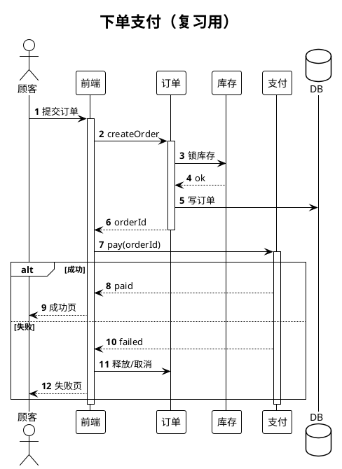

# 15 · 选型、实战与 FAQ

← [[14-Obsidian与工作流]] · [[PlantUML从入门到精通|目录]]

---

## 1. 选哪种图（决策表）

| 你想说清… | 优先 | 章节 |
|-----------|------|------|
| 调用顺序、鉴权、回调 | 时序图 | [[02-时序图]] |
| 谁能做什么功能 | 用例图 | [[03-用例图]] |
| 审批流、算法步骤 | 活动图 | [[04-活动图]] |
| 类型与关系（领域/设计） | 类图 | [[05-类图]] |
| 某一刻的实例数据 | 对象图 | [[06-对象图]] |
| 生命周期状态机 | 状态图 | [[07-状态图]] |
| 模块依赖 | 组件图 | [[08-组件图]] |
| 部署到哪 | 部署图 | [[09-部署图]] |
| 时间轴上的状态 | 定时图 | [[10-定时图]] |
| 计划排期 | 甘特 | [[11-非UML常用图]] |
| 主题拆解 | 思维导图 | [[11-非UML常用图]] |

**反例**：用类图硬画请求顺序；用活动图替代完整微服务依赖——都会别扭。

---

## 2. 综合实战：从需求到三张图

场景：商城「下单并支付」。

1. **用例**（边界）：顾客 → 下单支付；包含「加购」；店员/支付渠道作辅助角色。→ [[03-用例图]]  
2. **活动**（业务）：提交 → 锁库存 → 创单 → 支付 → 成功/失败分支。→ [[04-活动图]]  
3. **时序**（实现）：前端 → 订单 → 库存 → 支付 → 第三方；`alt` 成功失败。→ [[02-时序图]]  

可选第四张：**状态**（订单状态机）给后端同学。→ [[07-状态图]]

同一主题多图，用 wikilink 互相指向，不要揉成一张巨型图。

---

## 3. 完整时序复习稿（可直接改）

---

## 4. FAQ 排错

| 现象 | 可能原因 | 处理 |
|------|----------|------|
| 完全没图 | 语言标识不是 `plantuml` | 改 fence |
| Syntax Error | `alt/end` 不配对、缺少分号（活动图 `:动作;`） | 从中间一分为二定位 |
| 继承三角反了 | `<|--` 三角在父类侧 | 对照 [[05-类图]] |
| 中文乱码/方框 | 本地字体 | 换远端 server 或配中文字体 |
| 图极宽极乱 | 参与者过多 | 拆图；`order`；减少交叉 |
| include 失败 | 路径/插件不支持 | 复制片段；见 [[13-模块化与预处理]] |
| 甘特不渲染 | 用了 `@startuml` | 改 `@startgantt` |
| 敏感信息泄露 | 走了公网 server | 脱敏或本地 jar |

官方 FAQ：https://plantuml.com/zh/faq

---

## 5. 进阶方向（本系列之外）

- C4-PlantUML、AWS/Azure 图标库（标准 include）  
- Teoz 时序引擎（时长、锚点）  
- CI 里用 jar 批量渲染文档站点  
- 与 AsciiDoc / GitHub 渲染扩展集成  

需要时再开专题笔记，链回本目录即可。

---

## 6. 自测清单（「精通」及格线）

- [ ] 不看文档写出带 `alt` + `activate` 的登录时序  
- [ ] 能解释组合 vs 聚合，并画对符号  
- [ ] 能画带泳道的审批活动图  
- [ ] 能为当前项目画组件或部署草图之一  
- [ ] 会用 `!theme` 且知道本库嵌入规范  
- [ ] 出语法错时能 5 分钟内自查（标记、配对、fence）

全勾完：回到 [[PlantUML从入门到精通|目录]]，把练习图链进真实项目笔记。

---

## 参考

- https://plantuml.com/zh/  
- https://plantuml.com/zh/sequence-diagram  
- https://plantuml.com/zh/class-diagram  
- https://plantuml.com/zh/activity-diagram-beta  
- https://plantuml.com/zh/state-diagram  
- https://pdf.plantuml.net/PlantUML_Language_Reference_Guide_en.pdf
